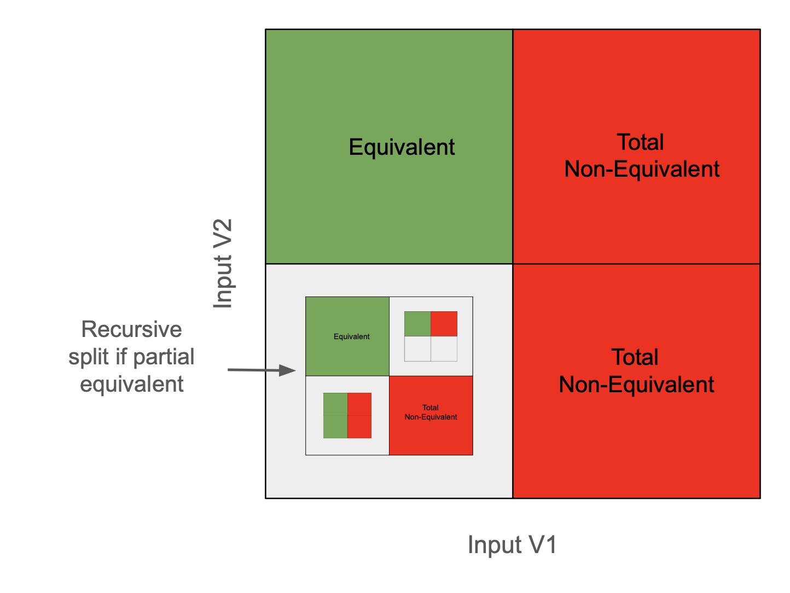
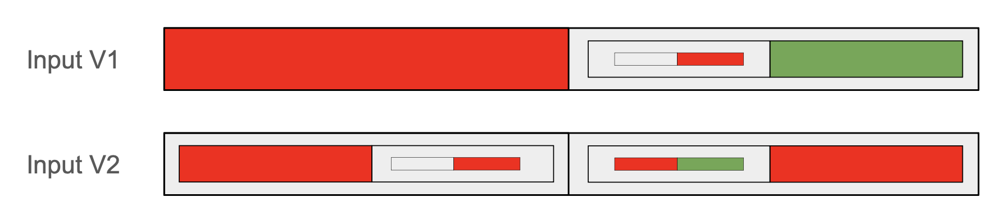
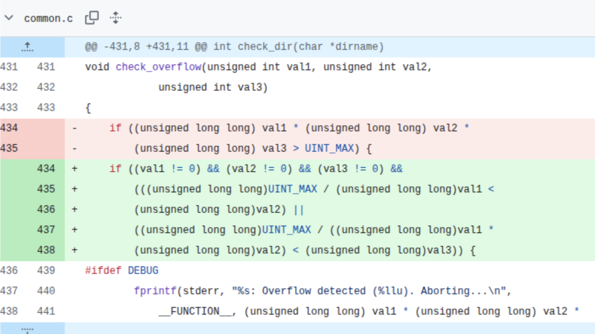
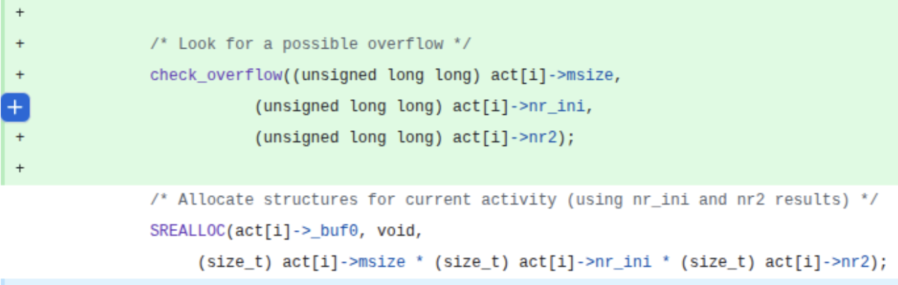

## Visualization of the Algorithm 2 (RangeSearch) and Algorithm 3 (Iterative Search)
<table>
  <tr>
    <td width="45%" align="center">
      
    </td>
    <td width="40%" valign="middle">
       
    </td>
  </tr>
</table>
Figure (left) shows a visual of our RangeSearch algorithm and (right) shows it for the Iterative rangeSearch algorithm.

## Another motivating example of Integer overflow and its patch
<table>
  <tr>
    <td width="45%" align="center">
      
    </td>
    <td width="40%" valign="middle">
       
    </td>
  </tr>
</table>
The figure (left) shows the change in the overflow function for multiplication and (right) shows the use of check_overflow function. These patches are very common where it is important to check the non-equivalence condition and its quantification.

