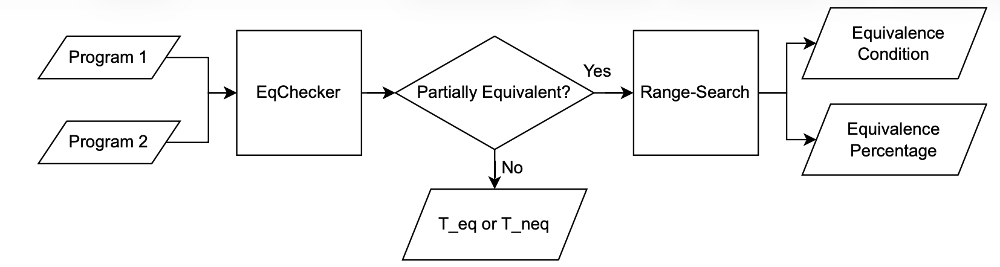
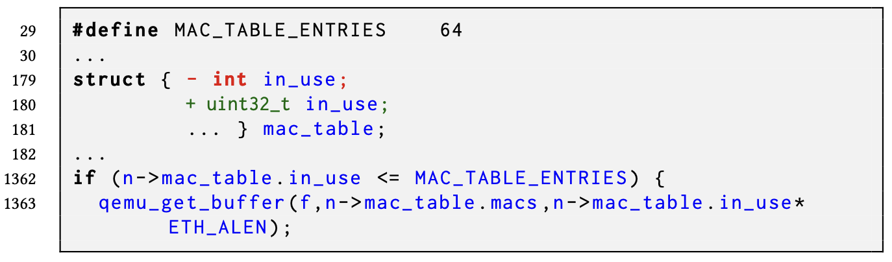
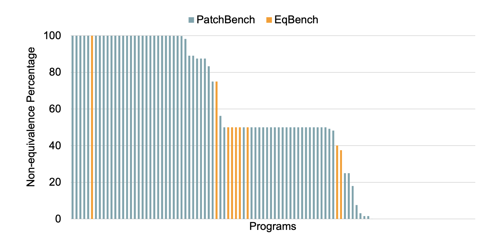
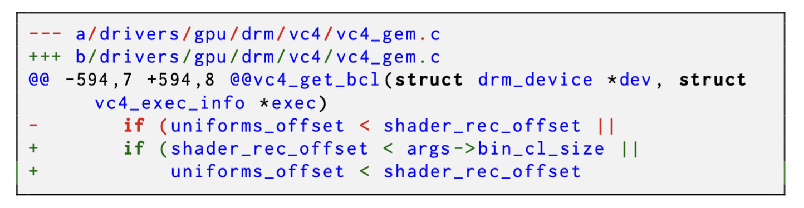
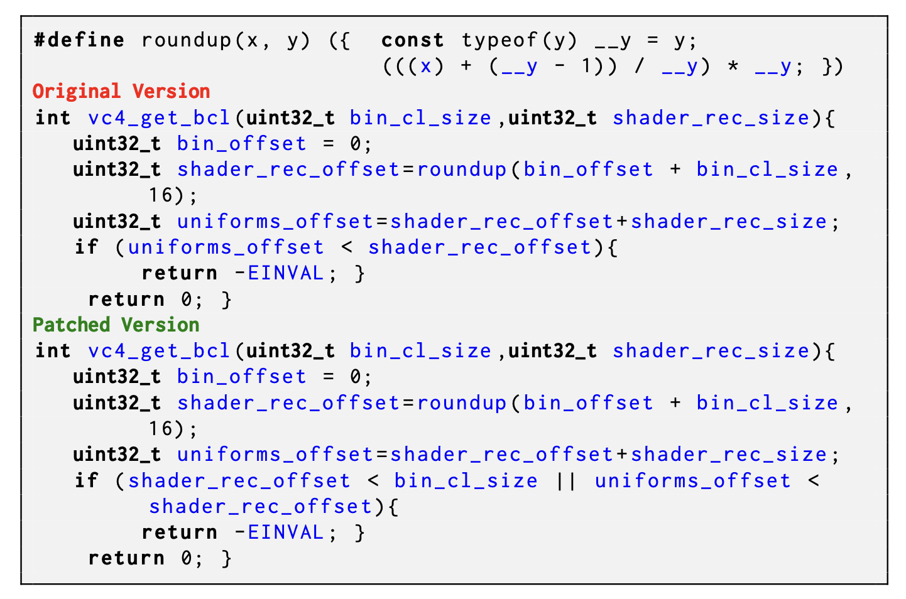
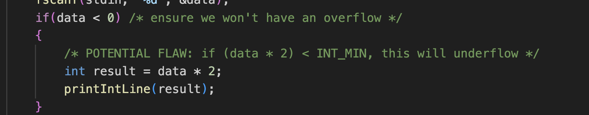
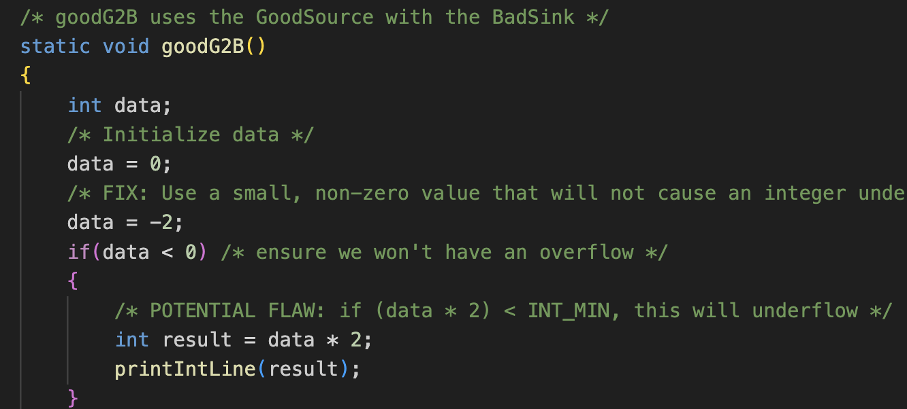
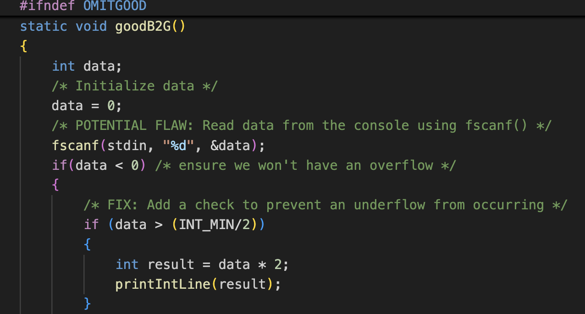

# Patch Impact Analysis

## Required Installation
**Pre-requisite for running :**

* python 3.8+
* angr (https://docs.angr.io/en/latest/getting-started/installing.html)
* Z3 
  

**Running the script file:**
1. workon angr
2. pip install claripy (if angr can not find any module to run pip install that module will install that particular module)

## Benchmarks
- EqBench: CLEVER, dart, pow
- PatchBench: qemu, linux, FFmpeg
- JulietBench (Bad and Good Patches)
  - Juliet Test Suite 
  - Juliet based PatchBench 

## Approaches
- EqChecker.py
- RelationalRangeSearch.py
- EnsembleRangeSearch.py
- Enumeration.py
- Projection.py
## Commands
- ``python3 EqChecker.py --b1 < binary1 > --b2 < binary2 > --fn < functionName > --r < returnType > --LB < bound > --home < location >``
- ``python3 EnsembleRangeSearch.py < neqConstraint > < eqConstraint > < bit > < location >``
- ``python3 RelationalRangeSearch.py < neqConstraint > < eqConstraint > < bit > < location >``
- ``python3 Projection.py < eqConstraint > < location > < SaveFileName >``
- ``timeout < time-limit > python3 Enumeration.py < constraint > < bit > > < fileToSave >``

## Command examples to run dart/test/EqWMain/ from EqBench
- ``python3 EqChecker.py --b1 oldV --b2 newV --fn snippet --r double --LB --home EqBench/dart/test/EqWMain/``
- ``python3 EnsembleRangeSearch.py EqBench/dart/test/EqWMain/ResultsnippetNEQ.smt2 EqBench/dart/test/EqWMain/ResultsnippetEQ.smt2 32 EqBench/dart/test/EqWMain/``
- ``python3 RelationalRangeSearch.py EqBench/dart/test/EqWMain/ResultsnippetNEQ.smt2 EqBench/dart/test/EqWMain/ResultsnippetEQ.smt2 32 EqBench/dart/test/EqWMain/``
- ``python3 Projection.py EqBench/dart/test/EqWMain/ResultsnippetEQ.smt2 EqBench/dart/test/EqWMain/ projection``
- ``timeout 120 python3 Enumeration.py EqBench/dart/test/EqWMain/ResultsnippetNEQ.smt2 32 > EqBench/dart/test/EqWMain/EnumResult.txt``

## Model Counter
- SearchMC: https://github.com/seonmokim/SearchMC
- Ganak: https://github.com/meelgroup/ganak.git
- ABC: https://github.com/vlab-cs-ucsb/ABC.git
- qCoral: https://pan.cin.ufpe.br/coral/QCORAL.html

## Convert from Bitvector to Dimacs cnf
- pydimacs: https://github.com/RobinDavid/pydimacs.git

## Workflow
<table>
  <tr>
    <td width="50%" align="center">
      
    </td>
    <td width="40%" valign="middle">
     The workflow of the partial equivalence analysis technique we present in the paper is shown in Figure. The EqChecker component (Algorithm 1) determines if the given programs are equivalent, totally non-equivalent, or partially equivalent. If two given programs are partially equivalent, our range-based search technique, which we present in the next section, provides (i) the equivalence condition and (ii) the equivalence percentage, i.e., the percentage of the input domain for which the given programs are equivalent.
    </td>
  </tr>
</table>
<!--

  

-->

## Motivating Example from Qemu 
<table>
  <tr>
    <td width="50%" align="center">
      
    </td>
    <td width="40%" valign="middle">
        A patch from Qemu is shown in the figure where a modification is made to prevent buffer overflow by changing the type of the variable in_use at line 180, which is later used in line 1362. Our quantitative patch impact analysis shows that this update will impact 50% of the inputs for variable in_use with the corresponding non-equivalence condition: 2147483648 <= in_use.
    </td>
  </tr>
</table>

<!--

  

A patch from Qemu is shown in the figure where a modification is made to prevent buffer overflow by changing the type of the variable in_use at line 180, which is later used in line 1362. Our quantitative patch impact analysis shows that this update will impact 50% of the inputs for variable in_use with the corresponding non-equivalence condition: 2147483648 <= in_use.
-->

## Dataset information
The number of lines of codes (LOC) of the programs in our dataset ranges between 8 to 64 with an average LOC of 24.76, 23.74, and 16.50, respectively for PatchBench, JulietBench and EqBench benchmarks.

## Patch Impact Analysis of EqBench 
<table>
  <tr>
    <td width="45%" align="center">
      
    </td>
    <td width="40%" valign="middle">
      The figure shows the percentage of non-equivalence (patch impact surface) of both PatchBench and EqBench. For EqBench, 62.5% of the program pairs exhibit non-equivalence for less than 10% of their input domain, with only one pair being non-equivalent for 99.99%. 
    </td>
  </tr>
</table>

<!--

  

The figure shows the percentage of non-equivalence (patch impact surface) of both PatchBench and EqBench. For EqBench, 62.5% of the program pairs exhibit non-equivalence for less than 10% of their input domain, with only one pair being non-equivalent for 99.99%. 
-->

## Patch Dataset from Git Commits of CVEs
<table>
  <tr>
    <td width="45%" align="center">
      
    </td>
    <td width="40%" valign="middle">
       
    </td>
  </tr>
</table>
The (Left) figure presents a CVE of category CWE-190 which represents a numerical error from Linux in function vc4_get_bcl. Given the patching context, we extracted code segments capturing only changes in the patched code segment using the provided project versions. (Right) figure shows an example of extracted code segments from the patch shown in the left one where a new condition is added in the patched version.

## Bad-Good Example from Juliet Test Suite
<table>
  <tr>
    <td width="33%" align="center">
      
    </td>
    <td width="33%" valign="middle">
       
    </td>
    <td width="33%" valign="middle">
       
    </td>
  </tr>
</table>
The example shows CWE-191_Integer_underflow example with original vulnerable code snippet(left), bad snippet (middle one) and good snippet (right most one). 

